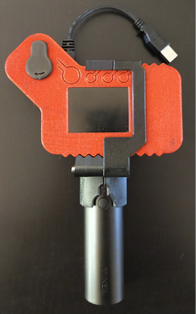
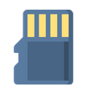
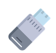
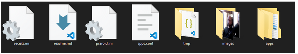

Pilaroid
-----------
Pilaroids is an OS to make autonomous camera with Raspberry Pi   
It is based on Interaction Research Studios project Probetools : https://probetools.net/



# Downloads
 * 📁 SD card: [Google Drive: pilaroid_23_08_2021.zip](https://drive.google.com/file/d/1ZX-iX2K74WXLs8QSD8VOEyrMSkti2_95/)
 * 📁 USB Drive : [Github : pilaroid_usb_last.zip](https://github.com/usini/pilaroid/releases/latest)
 * 📁 3D models : [Github : pilaroid_3Dmodels](https://github.com/usini/pilaroids_3Dmodels)

# Installation
In order to install Pilaroid, you need to flash the sdcard, and copy the software on the USB key

* SDCard contains the operating system, (which is a slighty modify version of Raspbian), it is (by default) write-protected
* USB key contains the photos, settings and python applications which make the camera works.

## SDCard


You need [Balena Etcher](https://www.balena.io/etcher/) to flash the SDCard   
📁 SD card: [Google Drive: pilaroid_23_08_2021.zip](https://drive.google.com/file/d/1ZX-iX2K74WXLs8QSD8VOEyrMSkti2_95/)

Go to **Flash From File**, select **pilaroid_XX_XX_XXXX.zip**,
In **Select Target**, choose your **microsd card**

## USB


Copy the files from the archive pilaroid-main.zip into the USB Drive   
📁 USB Drive : [Github : pilaroid_usb_last.zip](https://github.com/usini/pilaroid/releases/latest)   
    
    

You should have the following files and folders.
* 📁apps : Python applications
* 📁images : Photo Storage
* 📁tmp: Temporary folder
* 📜secrets.ini : Passwords file
* 📜pilaroid.ini : Settings file
* 📜apps.conf : Python applications start at boot (supervisord settings)

# Settings

### pilaroid.ini
[Default Settings](https://github.com/usini/pilaroid/blob/main/pilaroid.ini)

```ini
[APPLICATION]
name= camera name (as displayed in applications / network) 
type= used application (ex: selfie - gif - pano)
lang= applications language (fr - en)
encrypt= Basic encryption of passwords on usb drive
gif_rate= Images per seconds for GIF
gif_images= Pictures used for GIF
pano_images= Nb images used for panorama
pano_crop= Manual cropping for panorama

[FOLDERS]
images= Photos folders
temp= Temporary files folders

[CAMERA]
ratio= image aspect ratio (4:3 / 16:9)
quality= resolution (low - medium - high)

[OSC]
ip= ip to send OSC messages
port= port to send OSC messages
```

### secrets.ini
Settings are saved on a different file named **secrets.ini**, they can be encrypt at boot using the serial number of the Raspberry Pi.   
Encryption is not really safe, but it will make it harder to guess.   

[Default Settings](https://github.com/usini/pilaroid/blob/main/secrets.ini)   

```ini
[WIFI]
country = WiFi country (need to be set)
name = Wifi SSID
password = WiFi Password

[USER]
name = Username (as for now can't be changed)
password = Password (for terminal, windows sharing, api)
```

# Available Applications
You can find the code here: https://github.com/usini/pilaroid/tree/main/apps   

## Camera Applications
* selfie : Take a picture
* gif: Create a gif based on a sequence of photos
* pano: Generate a panorama based on photos

## System Applications

### setup: OS settings can't be modify (by default as the sdcard is write-protected), so this application will setup network/applications at boot.
* Change WiFi settings
* Change Raspberry Pi name
* Change terminal/windows sharing password
* Change application, if it has changed for the current settings. 

You can remove the USB Drive and boot the Pilaroid to temporarily reset pilaroid settings to default.    
You can also plug a USB keyboard to control it    

### webapi : A real-time websocket communication protocol, which send the current state of the camera (is it connected / callback when a new photo is available, et to make the pictures accessible using a web server.
It is required to work with [Pilaroid Projector](https://github.com/usini/pilaroid_projector/)   
It can be extended to add more functionalities)   

* pocca : A python library helper to make camera applications with Pygame / PiCamera
* controls : Button Manager (using gpiozero)
* display : Display management, using Pygame
* localization : Localization
* network : Network management
* ressources : (images / icons)
* utils (system information, settings management, system administration)
* vision (camera management, image manipulation (opencv), video conversion (ffmpeg)

### wsdd : Add support to Windows Web Service Discovery


